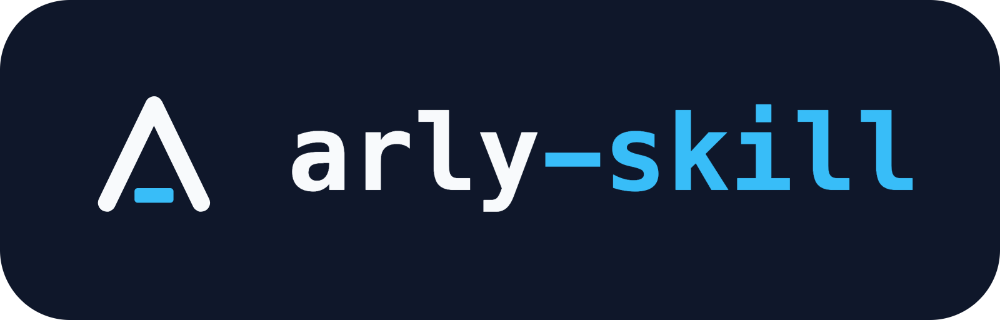

<p align="center">
  
</p>

<h1 align="center">/arly</h1>

<p align="center">
  
</p>

<h3 align="center">Build systems that hold up, and automate the work around them</h3>

Hi, I'm [Arly Trenck](https://trenck.net). I'm an IT systems engineer and infrastructure architect. My day job is enterprise IT across 29 offices in Connecticut, New York, and Massachusetts. At home I run a homelab the way I run production: the config in git, one command to rebuild the host, and backups I have actually restored from.

`/arly` is an agent skill built from my public runbooks, scripts, and writing. Ask it about servers, networks, identity, monitoring, backups, rollouts, or troubleshooting. It sends the situation to the right runbook, names the script that fits, and gives my view on the tradeoff. Where my public material does not cover a question, it says so and falls back to general knowledge.

## Install

```sh
npx skills add arlytrenck/arly-skill -g
```

Then ask it something:

```
/arly why does my new reverse-proxy vhost return 403 for everyone?
/arly how should I roll out MFA to a multi-site company?
/arly is my backup setup actually a backup?
/arly which of your scripts audits SSH keys?
```

## How it works

The skill file is thin on purpose. It loads four files from this repo, from a local clone if you are in one and from GitHub otherwise, and follows them.

| File | What it does |
|------|--------------|
| `ENTRY.md` | Routes a situation to the right runbook and sets how to answer. |
| `TOOLS.md` | My public repos, and which script or doc solves which problem. |
| `OPINIONS.md` | My views, each linked to where I wrote it down. |
| `VOICE.md` | How I write. Used only when writing as me. |

## What it won't use

Private repositories, unpublished drafts, and anything from an employer stay out, along with hostnames, addresses, tokens, and account details. `scripts/check.sh` scans for them before a commit.

## Keeping it current

A daily check tells me when a new post or a newly public repo means the files are behind, and I refresh them by hand. [`REFRESH.md`](REFRESH.md) has the rules. `scripts/refresh.sh` finds what is new, and `scripts/coverage.sh` flags any script or file name in `TOOLS.md` and `ENTRY.md` that has drifted from the public repos.

## Contributing

This is my own knowledge base, so it does not take pull requests. Issues with corrections or suggestions are welcome.

## Credit

The idea of a thin skill that loads a living, personal knowledge base comes from [kunchenguid/kun](https://github.com/kunchenguid/kun). Everything here was written from scratch from my own public work.
